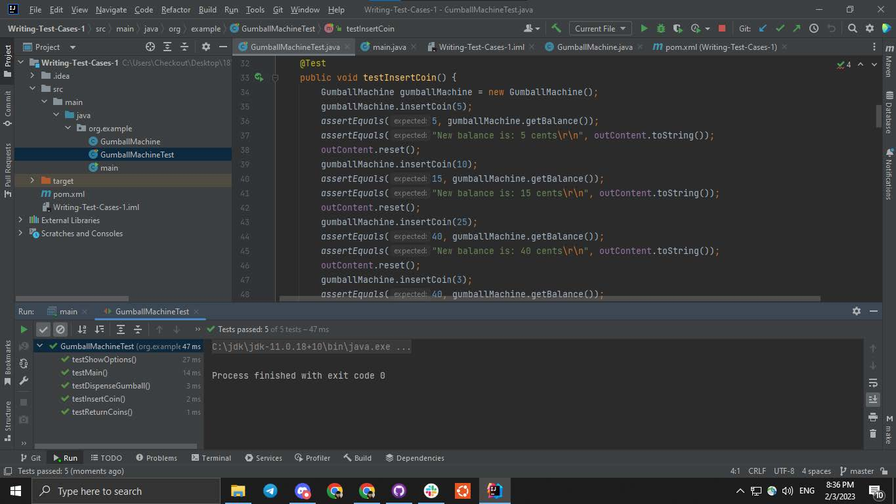

# Problem statement:

* Develop a gumball vending machine software that allows customers to insert only nickel,
  dimes or quarters as valid currency, dispense Red or Yellow gumballs based on the type selected,
  and return the change if necessary. The software should keep track of the gumballs dispensed and
  the amount of change returned.
* Generate Test Cases for Abstract design and for the Program, make them reasonable, and
  provide meaning for each test case.

## How to Run:

 * Program written in Java and can be run as a project in IntelIJ IDE
 * Here are some screenshot of program running:

# Test cases to cover all possible scenarios:

## Reasons for Test Cases (Abstract):

Design and Implement a Gumball Vending Machine that dispenses Red and Yellow
gumballs, accepts nickel, dime and quarter coins as payment, and returns change if necessary. The
machine will be equipped with two levers, one for Red gumballs and one for Yellow gumballs,
allowing customers to choose their preferred type. Customers can insert multiple coins until they
make a selection, at which point the machine will dispense one gumball. The machine will also
have a "Return My Change" lever, allowing customers to receive their remaining change after
making a purchase. The machine will have an unlimited supply of gumballs and change to
dispense.

## Test Case Presentation (Abstract):

* Verify that the machine only accepts nickel, dimes or quarters as valid currency.
* Verify that the machine dispenses the correct type of gumball based on the type selected.
* Verify that the machine dispenses a single gumball at a time.
* Verify that the customer can insert multiple coins before dispensing the gumball.
* Verify that the customer can return the change if necessary.
* Verify that the machine keeps track of the gumballs dispensed and the amount of change returned.
* Test the functionality of the "Return My Change" lever.
* Test the functionality of the Red and Yellow gumball dispenser levers.
* Test the machine's ability to dispense two Red gumballs when a quarter is inserted.
* Verify the machine's ability to handle unexpected inputs and provide appropriate responses.

### Reasons for Test Cases (Program):

The purpose of these test cases is to verify that the GumballMachine class behaves
correctly. The tests are written using the JUnit and Jupiter API. The test cases perform different
actions on the GumballMachine class such as inserting coin, dispensing the gumball, and returning
the coin. We also need to check the state of the classes such as the balance, or output messages and
ensure that they are updated correctly.The tests are designed to cover different edge cases and
validate that the class works as expected in each scenario.
	
The first test case made named **testInsertCoin** was made for the method insertCoin which
is one of the basic operations of the gumball machine. It is important that only certain types of
coins are allowed and that any other form of coins are seen as invalid inputs. For example, one of
the first requirements is that the machine needs to only accept nickels, dimes, and quarters. This
means that the machine has to know the difference between the coins and reject ones that are not
like those previous mentioned. Another reason for the test case is to make sure that the machine
can track the total value of coins that were inserted. The success of this type of functionality is
essential to other requirements mentioned.

The second test case was for **testDispenseGumball** which is to verify the the
dispenseGumball method of the GumballMachine class is working as expected. Four cases of
gumball dispensing are tested: Red, Yellow, Yellow again, and Red when no coins are inserted.
The test case verifies if the balance of the gumball machine is updated correctly for each input and
if the output message is as expected for each input. Another reason for this test case is to make
sure that it does not dispense gumballs with no balance left in the machine and tell the user to put
more money. Dispensing gumballs is the whole point of the machine; therefore, is it essential it
does it right.

The third test case was for **returnCoins**. This test case is needed to verify the functionality
of returning the change. It is important to know the current state of the gumball machine as a user
can try to return coins which have already been used. For example, if a user inserts a dime and
dispenses only one red gunball, a nickel would be returned. It is also pertinent to have this case
because we do not want the user to get more coins than they put in to the machine. This means that
the coin return function works as expected.

The **testMain** test case was made for the main method of the GumballMachine program.
The purpose of this test case is to verify that the program handles invalid inputs and returns the
correct message to the user. The test uses a ByteArrayInputStream to simulate user inputs and a
ByteArrayOutputStream to capture the program's output.
	The test inputs consist of various invalid inputs such as "u", "1000", "-25", " ", "hello", and
"q". The program should return an "Invalid input" message for each of these inputs. The "q" input
is used to exit the program and should return the message "--- EXITING FROM GUMBALL
MACHINE ---".
	The test checks if the output matches the expected result, which is a series of "Invalid
input" messages followed by the "--- EXITING FROM GUMBALL MACHINE ---" message. It is
important to test the program's ability to handle invalid inputs and provide appropriate responses as
this will help improve the user experience. Additionally, it verifies that the program does not crash
or produce unexpected results when faced with unexpected inputs.
	Note that this test case does not check for the functionality of the options such as inserting
coins, dispensing gumballs, getting the remaining coins, or displaying the options menu. These
functionalities are tested in separate test cases.

## Screenshot of All Test Cases Passes:

## Test Case Presentation (Program):

1. **testInsertCoin** is a JUnit test case for testing the insertCoin method of the
   GumballMachine class. The test case performs the following actions:
* Creates a GumballMachine instance.
* Calls the insertCoin method with the value 5 and asserts that the balance of the machine is 5.
* Asserts that the output to the console is "New balance is: 5 cents".
* Calls the insertCoin method with the value 10 and asserts that the balance of the machine is 15.
* Asserts that the output to the console is "New balance is: 15 cents".
* Calls the insertCoin method with the value 25 and asserts that the balance of the machine is 40.
* Asserts that the output to the console is "New balance is: 40 cents".
* Calls the insertCoin method with the value 3 and asserts that the balance of the machine is still 40.
* Asserts that the output to the console is "Invalid input, returned 3 on the push of the dispenses lever".
* Resets the output to the console between each test to read only last output.

2. **testDispenseGumball** is a JUnit test case for testing the dispenseGumball method of the
  GumballMachine class. The test case performs the following actions:
* Creates a GumballMachine instance.
* Sets the balance of the machine to 20 cents to skip to the testing part faster.
* Calls the dispenseGumball method with the color argument "r" and asserts that the balance of the machine is 15.
* Asserts that the output to the console is "Dispensing Red gumball, remaining coins: 15".
* Calls the dispenseGumball method with the color argument "Y" and asserts that the balance of the machine is 5.
* Asserts that the output to the console is "Dispensing Yellow gumball, remaining coins: 5".
* Calls the dispenseGumball method with the color argument "y" and asserts that the balance of the machine is still 5.
* Asserts that the output to the console is "Not enough coins inserted. Please insert 5 cents more".
* Sets the balance of the machine to 0 cents.
* Calls the dispenseGumball method with the color argument "r" and asserts that the output to the console is "Not enough coins inserted. Please insert 5 cents more".
* Resets the output to the console between each test to read only last output.

3. This test case checks the functionality of the **returnCoins()** method in the GumballMachine class.
* The GumballMachine object is instantiated and its balance is set to 25 cents.
* The first call to returnCoins("g") method returns all the inserted coins.
* The balance of the GumballMachine should be 0.
* The output message should be "Returning 25 cents in change".
* The second call to returnCoins("G") method does not return any coins as there are no coins in the machine.
* The balance of the GumballMachine should still be 0.
* The output message should be "No coins left to return".

4. This test case tests the **main** method of the program. The test case sets the input stream to
   simulate user incorrect inputs and sets the output stream to capture the program's output.
   The test inputs are:u, 1000, -25 ,hello, q. The expected output is:
* Invalid input
* Invalid input, returned 1000 on the push of the dispenses lever
* Invalid input
* Invalid input
* Invalid input
* --- EXITING FROM GUMBALL MACHINE — (and exits from program)
   The test case asserts that the output matches the expected output.

## Contributions

Vladislav Semenyutin (TEAM LEAD):

* Program code
* Test code
* Test Cases Presentation Abstract and Program
* Reasoning for Main test case in Program

Abdullah Waheed:

* Problem statement
* Reasons for test cases in Abstract
* Reason for test case testDispenseGumball in Program

Christian Hernandez:

* Reasons for Test Case testInsertCoin in Program
* Reasons for Test Case testDispenseGumball in Program
* Reasons for Test Case testReturnCoins in Program

Lovepreet Uppal:

* Reasons for Test Case returnCoins in Program
* Document formatting
